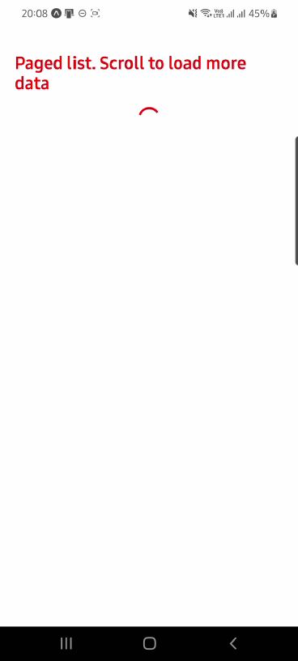

# react-native-paged-list

React Native component to load paged data in list by scrolling infinitely.

## Installation

```sh
npm install @death14stroke/react-native-paged-list
```

## Usage

```js
import { PagedList } from "@death14stroke/react-native-paged-list";
...
<PagedList
    firstPage={0}
    loadData={async page => {
        const hasMoreData = getMoreData(page);
        return hasMoreData;
    }}
    data={data}
    renderItem={renderItem}
    keyExtractor={keyExtractor}
/>
...
}
```

## Demo



## License

MIT
